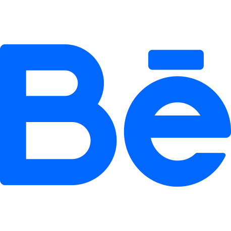

<h1 align="center">Hey there 👋🏼, I'm Kaiser</h1>
<h3 align="center">I'm a Front End Web Developer, Graphic Designer and Microsoft Learn Beta Student Ambassador.</h3>

  

&nbsp;

- 👨‍💻 Visit my website [https://www.kaiserahmed.xyz/](https://www.kaiserahmed.xyz/)

- 📝 I write tech articles on [https://kaisereduant.blogspot.com/](https://kaisereduant.blogspot.com/)

- 📫 Reach me at **inkaiserahmed@gmail.com**

- ⚡ My hobbies are **playing action video games, watching action movies, and listening to music.**

## Connect with me

## Languages and Tools

 
 
 
 
 
 
 

## Statistics and Languages

 
     
    

