Hello there! This is Kaiser! 

I am a Full Stack Developer who strives to build highly functional, immersive and beautiful web applications through carefully crafted code and user-centric design. I love spending time on fixing little details and creating optimized solutions.

I have an immense interest in Web Development, UI/UX Design, and Cloud Computing. I love collaborating with new people, having quality talk, and making moments worthy and lively.

📭 Reach Out: inkaiserahmed@gmail.com  
🚀 Resume: [s_m_kaiser_ahmed_cv](https://drive.google.com/file/d/1uL1ggmB6BgkLnl3oVUCTxG4uNxIUyNjR/view)

    

---

## Tools And Technologies

### ⚡ Expertise

<a href="https://www.w3.org/html/"> 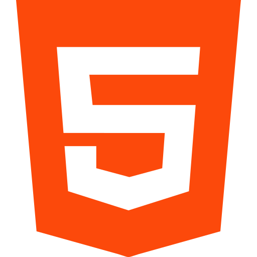 </a>
<a href="https://www.w3schools.com/css/"> 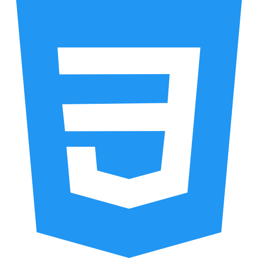 </a>
<a href="https://getbootstrap.com/"> 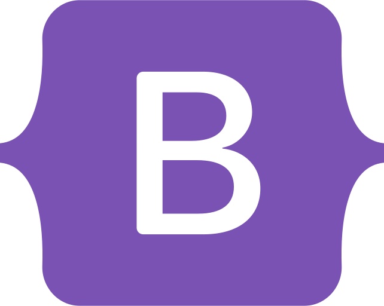 </a>
<a href="https://sass-lang.com/"> 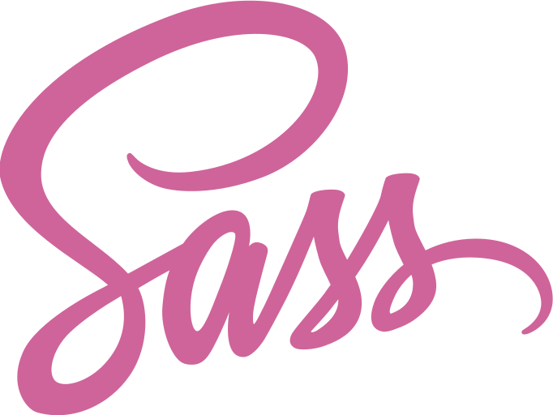 </a>
<a href="https://tailwindcss.com/"> 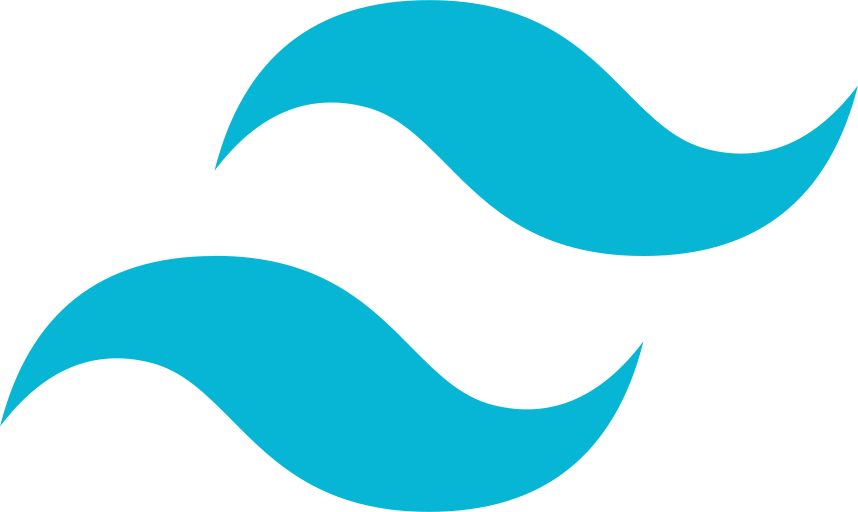 </a>
<a href="https://www.javascript.com/"> 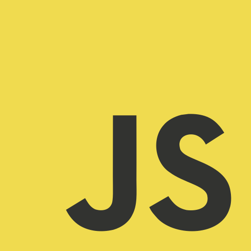 </a>

<a href="https://nextjs.org/"> 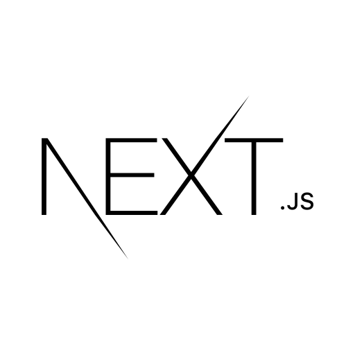 </a>
<a href="https://redux.js.org/"> 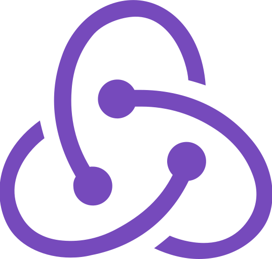 </a>
<a href="https://www.mongodb.com/"> 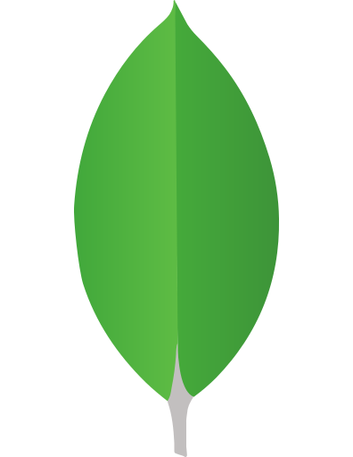 </a>
<a href="https://nodejs.org/en/"> 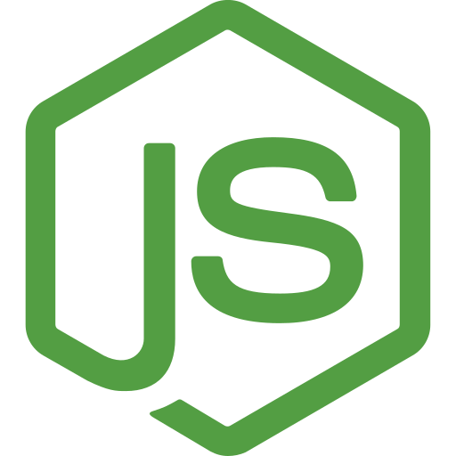 </a>

### ⚡ Comfortable

<a href="https://www.typescriptlang.org/"> 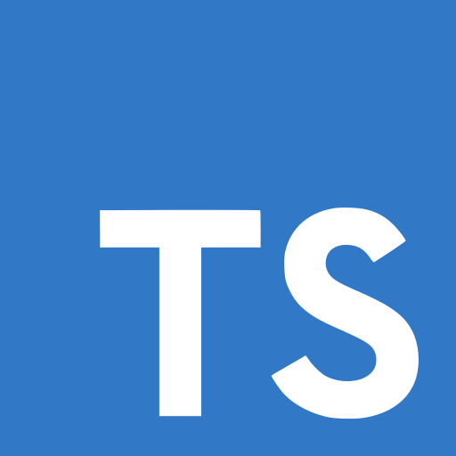 </a>
<a href="https://material-ui.com/"> 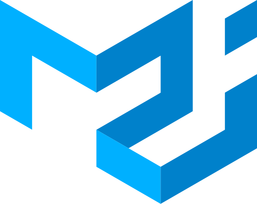 </a>

### ⚡ Familiar

<a href="https://reactnative.dev/"> 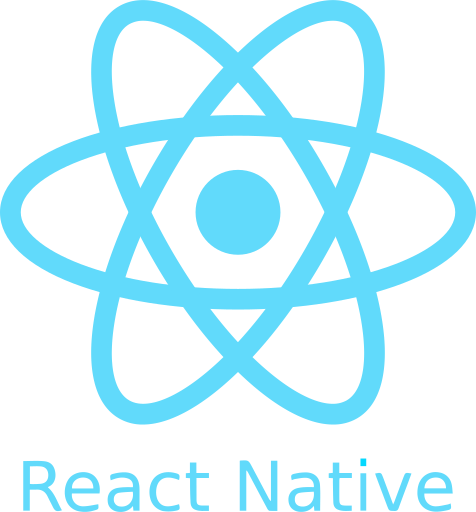 </a>
<a href="https://azure.microsoft.com/en-us/"> 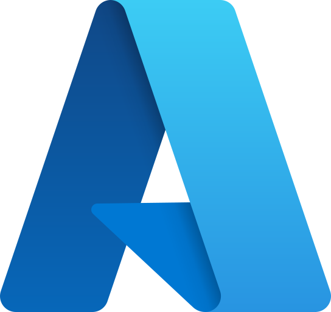 </a>

### ⚡ Tools

<a href="https://git-scm.com/"> 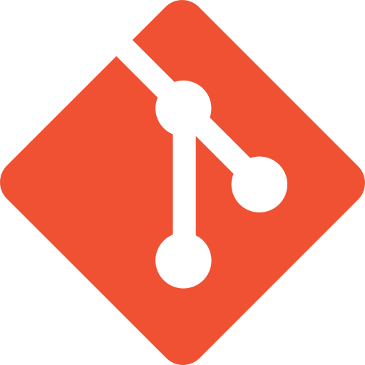 </a>

### ⚡ Designs

<a href="https://www.figma.com/"> 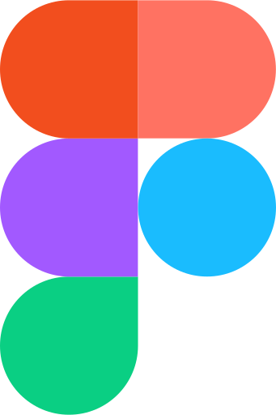 </a>
<a href="https://www.adobe.com/in/products/illustrator.html"> 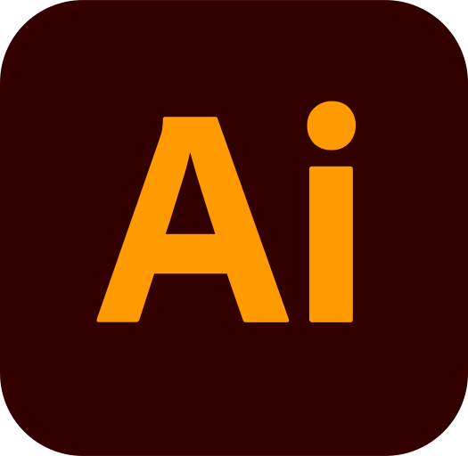 </a>
<a href="https://www.photoshop.com/en"> 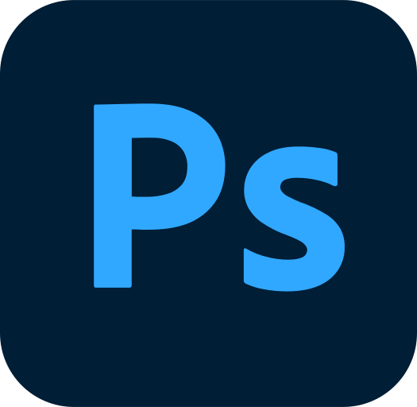 </a>

## Favorite Projects

- [Promptnest](https://github.com/mekaiser/promptnest)
- [Slack Clone](https://github.com/mekaiser/slack-clone)
- [Netflix Clone](https://github.com/mekaiser/netflix-clone)
- [React Typescript To-Do App](https://github.com/mekaiser/to-do-app)

## Statistics And Languages

 
     
    

